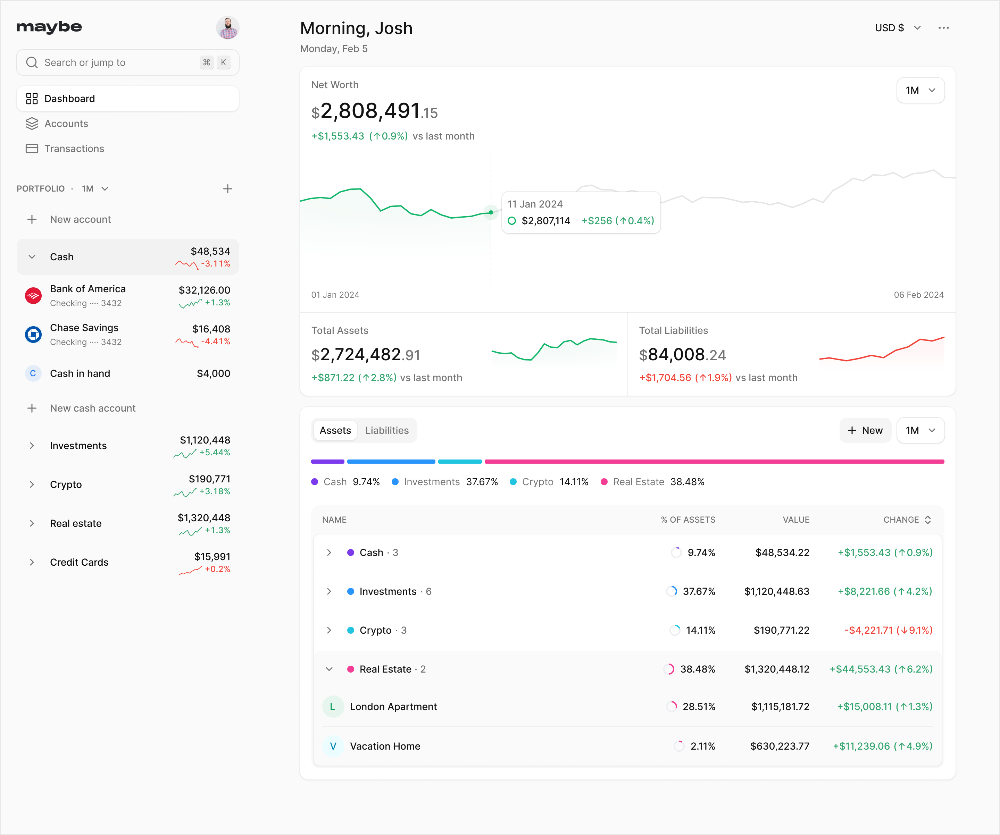

# Maybe CI/CD pipeline

Deploy Maybe Finance with CI/CD on Elestio

 
 

# Once deployed ...

You can open Maybe UI here:

    URL: https://[CI_CD_DOMAIN]

To get started, you need to create a user account.

You need to provide your, login info

> For any signup, you'll need an invite code that's stored in your `.env` file. To find it, go to Tools > Open VS Code, then navigate to the `.env` file. Use the invite code from there to sign up or add new users.
